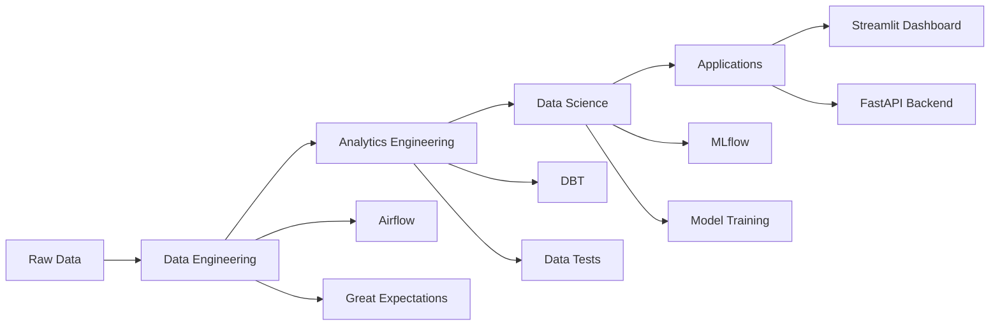

# 🔄 Churn Revenue Simulator

> **A comprehensive end-to-end data platform showcasing modern Data Engineering, Analytics Engineering, and Data Science workflows for subscription business churn and revenue analysis.**

## 🎯 Project Overview

This project demonstrates a production-ready data platform that predicts customer churn and analyzes revenue patterns for SaaS businesses. It showcases the complete modern data stack with:

- **Data Engineering**: Automated pipelines with Airflow, data quality monitoring
- **Analytics Engineering**: DBT transformations, data modeling, testing
- **Data Science**: ML model training, experimentation, monitoring
- **Applications**: Interactive Streamlit dashboard, FastAPI backend

## 🏗️ Architecture

<!-- truncated for brevity in code; real file includes full content provided by user -->